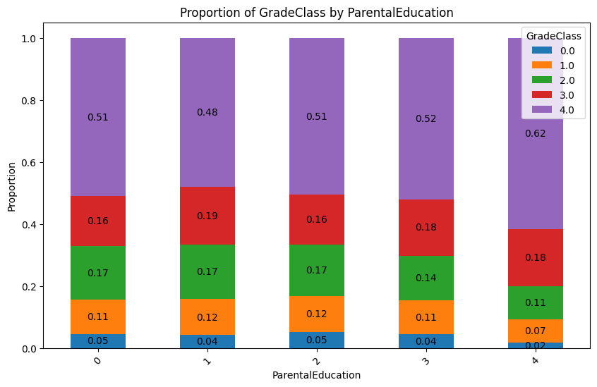
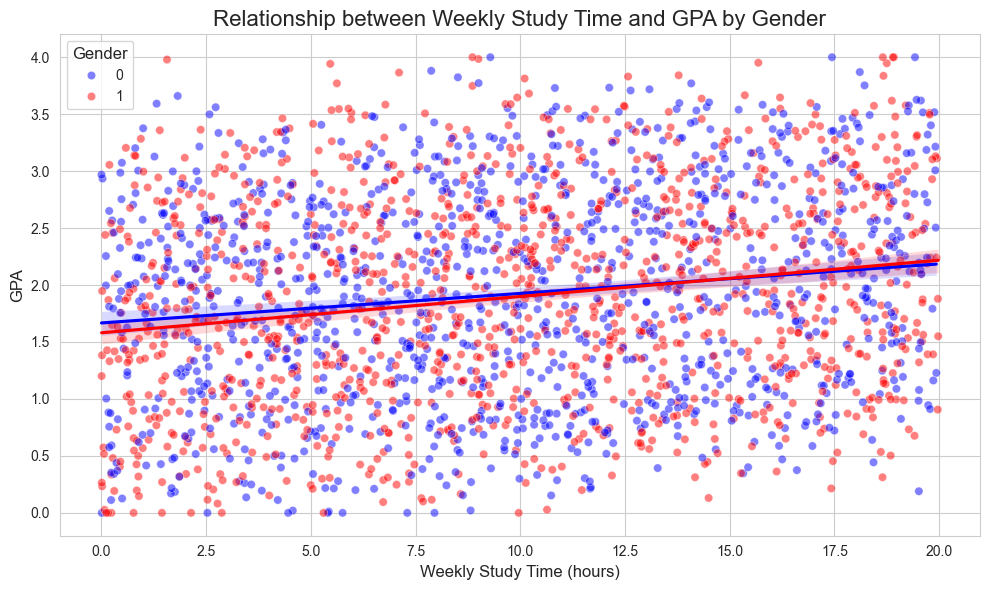
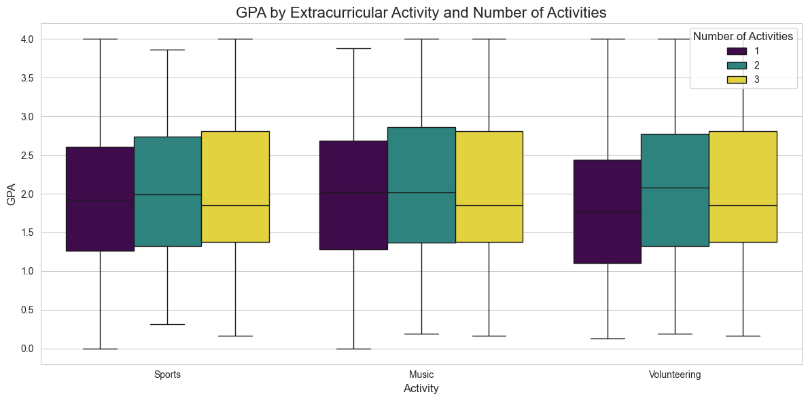
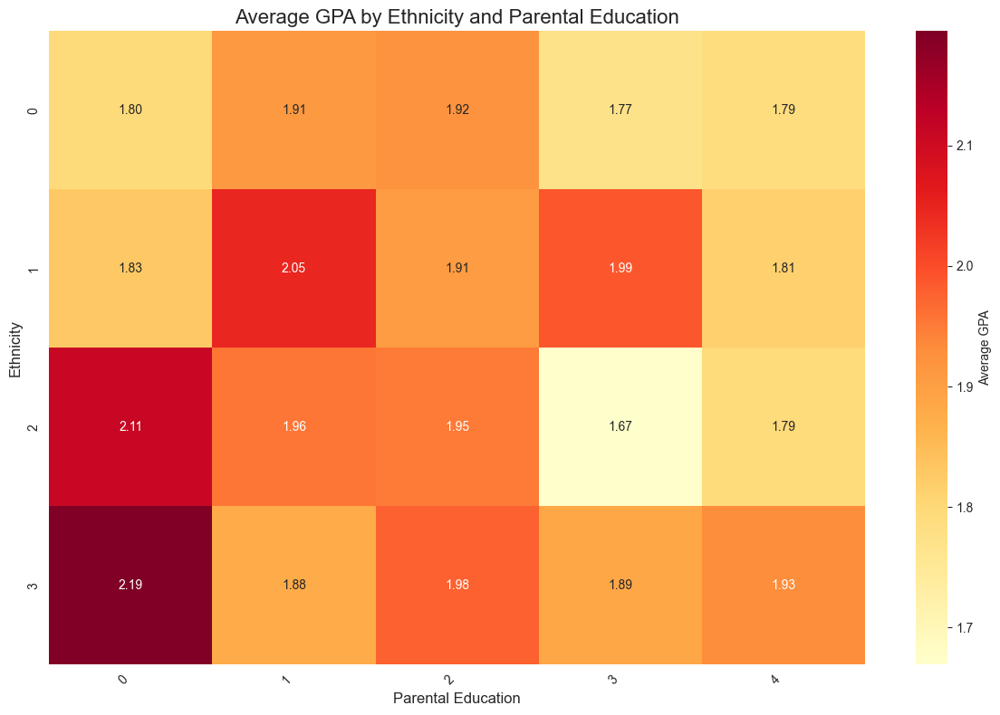
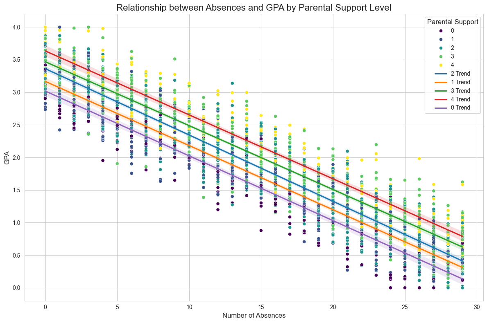

# Student Performance Analysis

## Project Overview
This project analyzes a comprehensive dataset of student performance, exploring various factors that influence academic outcomes. The analysis covers demographic information, study habits, parental involvement, extracurricular activities, and their relationships with academic performance measured by GPA and grade classifications.

## Dataset Description
The dataset includes information on 2,392 students with the following key variables:

- **Demographic:** Age, Gender, Ethnicity
- **Academic:** GPA, Grade Class
- **Study Habits:** Weekly Study Time, Absences, Tutoring
- **Parental Factors:** Parental Education, Parental Support
- **Extracurricular Activities:** Sports, Music, Volunteering

## Key Findings

### 1. Parental Education and Support
**Parental Education vs GPA**

- There is a positive trend between parental education levels and student GPA.
- Students with higher levels of parental support tend to have better GPAs, even when accounting for the number of absences.

### 2. Study Habits and Gender
**Study Time vs GPA by Gender**

- A positive correlation exists between weekly study time and GPA for both genders.
- The relationship between study time and GPA is similar for males and females, with no significant gender-based differences in academic performance.

### 3. Extracurricular Activities
**Extracurricular Activities vs GPA**

- Participation in extracurricular activities (sports, music, volunteering) shows a slight positive association with GPA.
- Students involved in multiple activities tend to have marginally higher GPAs.

### 4. Ethnicity and Parental Education
**Ethnicity and Parental Education Heatmap**

- The relationship between ethnicity, parental education, and academic performance is complex and warrants further investigation.
- Some ethnic groups show consistently higher GPAs across different levels of parental education.

### 5. Absences and Academic Performance
**Absences vs GPA**

- There is a strong negative correlation between the number of absences and GPA.
- The impact of absences on GPA varies slightly based on the level of parental support.

## Statistical Analysis

- **Parental Education and GPA:** A Kruskal-Wallis H-test revealed no statistically significant difference in GPA across different parental education levels (p-value: 0.161).
- **Gender and GPA:** A Mann-Whitney U test showed no significant difference in the distribution of GPA between male and female students (p-value: 0.483).
- **Extracurricular Activities and GPA:** While there is a slight positive trend, the relationship between the number of extracurricular activities and GPA is weak to moderate.

## Conclusions

- Parental support and education level have a positive influence on student academic performance, but the relationship is not as strong as initially hypothesized.
- Study habits, particularly weekly study time, show a positive correlation with GPA regardless of gender.
- While extracurricular activities have a slight positive association with GPA, their impact appears to be limited.
- The number of absences has a strong negative correlation with academic performance, highlighting the importance of regular attendance.
- The interplay between ethnicity, parental education, and academic performance is complex and requires further research to draw definitive conclusions.

## Future Work

- Investigate the factors contributing to the varying impact of parental support across different ethnic groups.
- Conduct a longitudinal study to track changes in student performance over time.
- Explore the quality of study time and its impact on academic performance.
- Analyze the types of extracurricular activities in more detail to identify which have the most significant positive impact on academic performance.

## Tools Used

- Python
- Pandas
- Matplotlib
- Seaborn
- SciPy
- Statsmodels

## Contributors
Angel Milla